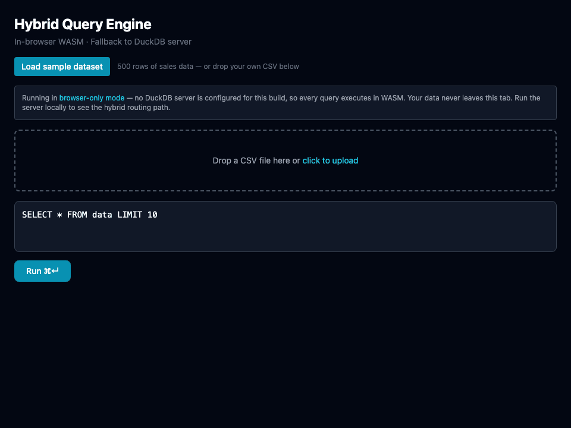
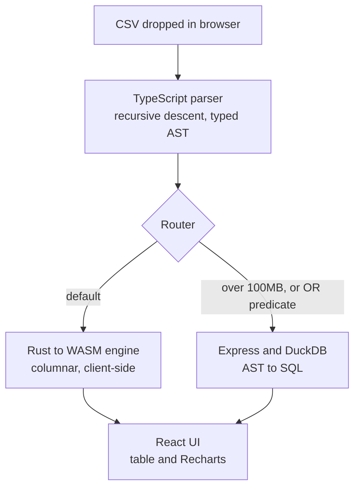

# Hybrid Query Engine

SQL over CSV files, executed in your browser. Drag in a file, write a query, get results and a chart — the data never leaves the tab.

**[▶ Try the live demo](https://shivanibakshi05.github.io/hybrid-query-engine/)** — no signup, no upload, sample dataset included.



A TypeScript SQL parser produces a typed AST that two different backends can execute: a columnar engine written in Rust and compiled to WebAssembly that runs client-side, and DuckDB behind an Express server for what the browser can't handle. A router picks between them per query.

I built it to learn query engine internals — columnar storage, recursive-descent parsing, and what actually makes analytical queries fast — by implementing them rather than reading about them.

---

## The result that changed the design

The original premise was straightforward: browsers are fine for small data, a real database wins on large data, so route by dataset size. I set the threshold at 100MB and moved on.

Then I benchmarked it, and the premise didn't survive.

At 100MB, DuckDB executes a `GROUP BY` aggregate in **145 ms** against the WASM engine's **1.25 s** — 8.6× faster, exactly as expected. But the server can't start until the CSV reaches it, and 100MB at 50 Mbps is a **16.8 second** upload. End to end, the browser wins by more than 13×.

That holds at every size I measured, because of something structural I had missed: **in this app the data is already in the browser.** The user dropped it there. Routing to the server means uploading a file you already have, and DuckDB's execution advantage is real but almost never redeemable.

So the server path isn't justified by speed. It's justified by capability — memory ceilings, and JOINs the WASM engine doesn't implement. Same architecture, different reason, and the routing rules ought to be derived from that rather than from a round number I guessed.

## Benchmarks

Median of 3 runs, Apple M4 Pro, Node 22. Reproduce with `npm run bench -- 1 10 50 100`.

| Dataset | Rows | Query | WASM | DuckDB (exec) | Server total @ 50 Mbps | Winner |
| --- | ---: | --- | ---: | ---: | ---: | --- |
| 1 MB | 19,265 | filter | **30 ms** | 92 ms | 260 ms | WASM |
| 1 MB | 19,265 | group + aggregate | **10 ms** | 77 ms | 245 ms | WASM |
| 10 MB | 189,489 | filter | **321 ms** | 241 ms | 1.92 s | WASM |
| 10 MB | 189,489 | group + aggregate | **122 ms** | 104 ms | 1.78 s | WASM |
| 50 MB | 939,724 | filter | **1.65 s** | 849 ms | 9.24 s | WASM |
| 50 MB | 939,724 | group + aggregate | **592 ms** | 116 ms | 8.50 s | WASM |
| 100 MB | 1,862,074 | filter | **3.42 s** | 1.72 s | 18.50 s | WASM |
| 100 MB | 1,862,074 | group + aggregate | **1.25 s** | 145 ms | 16.92 s | WASM |

`Server total` is DuckDB execution plus the upload it needs first. The WASM path has no transfer cost.

Two things worth reading off this table beyond the headline:

**DuckDB's aggregate time is nearly flat** — 77 ms at 1MB, 145 ms at 100MB. A 100× increase in data costs it 1.9×. The WASM engine goes 10 ms → 1.25 s, which is linear. DuckDB streams the CSV and pushes aggregation down; my engine materializes every column first. That gap is the clearest lesson in the project.

**Filters scale badly on both paths** — 3.42 s versus 1.72 s at 100MB, a gap of only 2×. `SELECT *` returns most of the rows either way, so output materialization dominates and the choice of engine barely matters.

### What these numbers don't cover

- Benchmarks run in **Node, not a browser**. Real WASM figures will differ — different engine, tighter memory limits.
- Upload time is **projected from bandwidth**, not measured across a real network. The HTTP column in `npm run bench` measures a localhost round trip, where transfer is effectively free.
- The WASM engine never ran out of memory, even at 1.86M rows, so its actual ceiling is still unmeasured. The routing threshold is still not derived from anything.

## Architecture



| Package | What it does |
| --- | --- |
| `packages/parser` | Lexer and recursive-descent parser. SQL string to typed AST. No dependencies. |
| `packages/engine-wasm` | Rust columnar store compiled to WebAssembly. CSV ingestion, filter, group-aggregate, sort. |
| `packages/router` | Chooses an execution path, and drives the WASM engine from an AST. |
| `packages/server` | Express and DuckDB. Translates the same AST to SQL for the fallback path. |
| `packages/ui` | React 18, Vite, Tailwind, Recharts. |

Both backends consume the identical AST, so the parser is the only place SQL semantics live.

### Supported SQL

`SELECT` with columns, `*`, and aggregates (`SUM`, `COUNT`, `AVG`, `MIN`, `MAX`) with optional `AS` aliases · `WHERE` with `=`, `!=`, `>`, `>=`, `<`, `<=`, `LIKE`, `IN`, combined with `AND` / `OR` · `GROUP BY` · `ORDER BY` on a column or an aggregate · `LIMIT`

## Running it

Requires Node 22+, Rust 1.96+, and [wasm-pack](https://rustwasm.github.io/wasm-pack/installer/).

```bash
npm install
npm run build     # builds the WASM engine and every TypeScript package
npm test          # 40 tests
npm run dev       # http://localhost:5173/hybrid-query-engine/
```

`npm run build` has to run before `npm test` — packages resolve each other through their compiled output.

The DuckDB fallback is optional. Without it the UI runs every query in WASM and says so:

```bash
npm run start -w @hybrid-query-engine/server   # localhost:3001
```

The UI reads `VITE_SERVER_URL` and falls back to browser-only when it is unset, which is how the hosted demo runs.

## Known limitations

Roughly in the order they would bite you:

- **No JOINs** in the WASM engine, and the parser doesn't accept them either. Multi-table queries have nowhere to go.
- **`OR` predicates route to the server**, because the executor only walks `AND` chains. That is an engine gap filed as a routing rule, which is the wrong place for it.
- **One `GROUP BY` column and one aggregate** per query, though the parser accepts more.
- **The 100MB threshold is a guess**, and the benchmarks above suggest it is measuring the wrong property.
- **No streaming ingestion** — the whole CSV is read into memory before anything runs.

## License

MIT
